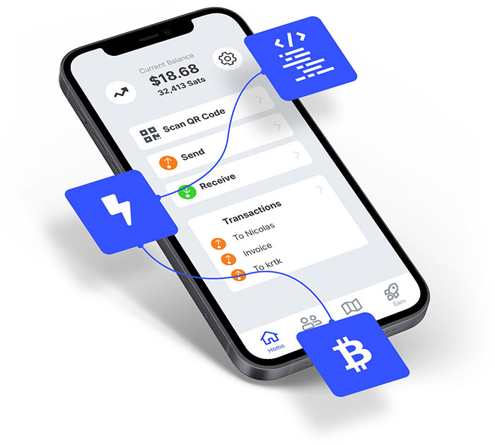

# Awesome Galoy ⚡ 

A curated list of the [**galoy**](https://galoy.io/) set of apps & services that can be combined to offer Bitcoin-based community banking.

The **galoy** system allows someone to setup a system of bitcoin on-chain and lightning network wallets and an internal account system to support offering bitcoin-based accounts to end users.

With a **galoy**-based account, users are able to:
- [x] send/receive bitcoin on-chain
- [x] send/receive bitcoin over the Lightning Network
- [x] send/receive bitcoin to other Galoy instance users at little to no cost
- [x] automatic internal settlement when payer & payee are on the same galoy instance
- [x] do transactions with realtime price conversions to supported fiat currencies
- [x] find merchants to spend with on a local area map

As a galoy administrator, admin users can:
- [x] control & monitor different aspects around users & transactions
- [x] visualize various aspects of the instance's performace via dashboards

## Tech components

A collection of the various tools and repos available for setting up your own bitcoin community-based bank.

### Backend

A collection of repos that can be used to deploy the backend components required to support a bitcoin community bank.

- [**`galoy`**](https://github.com/GaloyMoney/galoy)

  The backend application that interacts with the bitcoin and accounting layers to enable sending, receiving and holding balances.

- [**`galoy-infra`**](https://github.com/GaloyMoney/galoy-infra)

  ...

- [**`charts`**](https://github.com/GaloyMoney/charts)

  ...

- [**`price`**](https://github.com/GaloyMoney/price)

  ...

- [**`dealer`**](https://github.com/GaloyMoney/dealer)

  ...

### API
- [**`galoy`**](https://github.com/GaloyMoney/galoy)

  A GraphQL API that exposes the internal functions 
  of the galoy application.

- [**`api-docs`**](https://github.com/GaloyMoney/api-docs)

  Documentation for the galoy GraphQL API

### Frontend
- [**`galoy-tips`**](https://github.com/GaloyMoney/galoy-tips)

  A single page for each user of a galoy instance, that consumes the instance's GraphQL Api to present a QR code users can share for receiving payments via the Lightning Network. 

- [**`admin-panel`**](https://github.com/GaloyMoney/admin-panel)

  A dashboard that can be used to do various administrative functions by the admins of a given galoy instance.

- [**`galoy-mobile`**](https://github.com/GaloyMoney/galoy-mobile)

  A mobile app to be used as a wallet by end-user, that consumes the GraphQL Api of a given galoy instance.

## Galoy in the wild

_Examples of deployed galoy instances._

### 🏄 Bitcoin Beach Wallet Project

A community project deployed in the surfing village of El Zonte in El Salvador.

#### Mobile app
_Available in selected jurisdictions_
- Apple App Store: https://apps.apple.com/be/app/bitcoin-beach-wallet/id1531383905
- Google Play Store: https://play.google.com/store/apps/details?id=com.galoyapp

#### Tips pages
Live at: https://ln.bitcoinbeach.com

## Genesis

Today’s wallets are typically on two ends of a spectrum: either custodial, managed by an exchange and often large, regulated corporations, or non-custodial, open source wallets.

There is really not much in the middle: a custodial wallet that is open source and one that can be deployed for a local community. This would enable any tech-savvy person to deploy a union-bitcoin-bank for their own community, anywhere in the world.

Galoy aims to bring this type of wallets to the bitcoin world.

This quote from [Hal Finney](https://bitcointalk.org/index.php?topic=2500.msg34211#msg34211) probably echoes best the vision in which Galoy would operates:

> Actually there is a very good reason for Bitcoin-backed banks to exist, issuing their own digital cash currency, redeemable for bitcoins. Bitcoin itself cannot scale to have every single financial transaction in the world be broadcast to everyone and included in the block chain. There needs to be a secondary level of payment systems which is lighter weight and more efficient. Likewise, the time needed for Bitcoin transactions to finalize will be impractical for medium to large value purchases.
>
> Bitcoin backed banks will solve these problems. They can work like banks did before nationalization of currency. Different banks can have different policies, some more aggressive, some more conservative. Some would be fractional reserve while others may be 100% Bitcoin backed. Interest rates may vary. Cash from some banks may trade at a discount to that from others.
>
> George Selgin has worked out the theory of competitive free banking in detail, and he argues that such a system would be stable, inflation resistant and self-regulating.
>
> I believe this will be the ultimate fate of Bitcoin, to be the "high-powered money" that serves as a reserve currency for banks that issue their own digital cash. Most Bitcoin transactions will occur between banks, to settle net transfers. Bitcoin transactions by private individuals will be as rare as... well, as Bitcoin based purchases are today.

## An open source bitcoin banking solution

There is plenty of effort to develop non-custodial wallets. But understanding how those wallets work is hard for people with a minimal tech background. Also, non-custodial wallets will likely not be economical in regards to their onchain fees for many low-income countries as highlighted in a prior article [Lightning as a retail payment system](https://medium.com/galoymoney/lightning-as-a-retail-payment-system-part-1-7463c46342ef).

On the other side of the spectrum, custodial wallets and exchanges have aggregated a large user base, which is against the idea and goal of decentralization brought by bitcoin. Those wallets are typically not open source because the entities behind it are seeking to maximize profit, and their wallet and matching engine represents a large part of their technical IP.

An open source bitcoin banking solution would have the benefits of pooling capital, and thus make the capital efficacy available to those users with the benefits of reduced fees like batch transactions, lightning channel management, no cost for “on us” transactions, and lower cost per user for maintaining online servers.

The risk of a custodial wallet can be reduced with multisig solutions where keys are spread around the community, and with a proof of reserve showing ongoing solvency of the bank. Also, if bitcoin banking is being developed within local communities, those banks would be small enough to not become a regulatory target like big banks/custodians are.

Those banks could be launched by anyone around the world because plugging into the bitcoin network is available to anyone, unlike traditional permissioned payment gateways.
